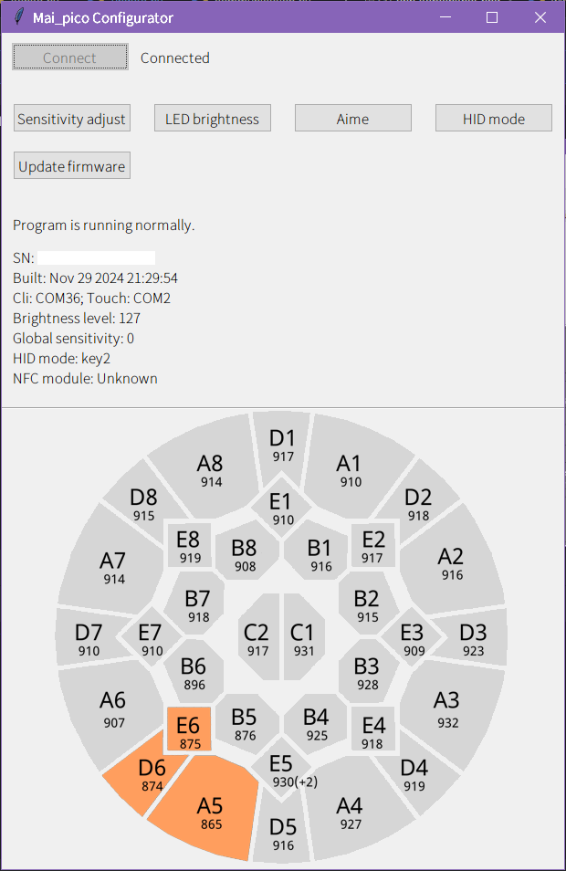

# mai_pico_configurator

This is a visualize configurator for [mai_pico](https://github.com/whowechina/mai_pico), writing in Python Tkinter framework.

## Screenshots

## To-do

- Support for non Windows platforms.

- Add more functions.

Any suggestions for new features, bug report ~~or pull requests~~ are welcome.

The project is still under development, the stable version will be released soon. Stay tuned!

## Introduction

The project provides a configuration GUI for the project [mai_pico](https://github.com/whowechina/mai_pico).

Mainly relies on communicating with the CLI serial port, and parsing the response text from CLI serial port.

For the first time use, you need to ensure that you have installed the Python which version is larger than 3.8, and run `pip install -r requirements.txt` in this project directory.

Run command `py main.py` **in this project directory** to start this program, and click `Connect` button to connect to your device and use.

### Features

- It is possible to run on non Windows platforms.

- Show in a larger interface if you are using dual screens and/or your screen is displaying in portrait. You can disable this feature in `config.yaml`.

- Automatically get the COM port information and modify the config if you don't config it properly. It works on Windows and implements with Powershell. This can also be disabled in `config.yaml`.

- Real-time displaying of its sensor raw readings, sensitivity adjustment, and sensor touching.

### Sensitivity adjust

Click the "Sensitivity" button, type the area you want to adjust using your keyboard, and adjust it using arrow `←` or `→`. Then apply the changes with Enter.

You can turn back to the main screen by pressing `Esc`. This is also available to the following functions.

### LED brightness

Click the "LED brightness" button, and a window will pop up. Slide the slider to adjust the brightness level.

Click "Apply" to make the changes take effect. The "OK" button will apply and close the window.

### Button adjust

t.b.c.

### Aime

Click the "Aime" button, use arrow `↑` and `↓` to navigate option, and use arrow `←` or `→` to adjust the target value.

Apply the settings by pressing Enter.

### HID mode

Click the "HID mode" button, and change the mode using arrow `↑` and `↓`.

You must know the difference of these mode.

Press Enter to apply.

### Update

Just simply click the "Update firmware". The program will exit and the disk for placing the firmware will appear.

## Special thanks

- [Python](https://python.org)

- [mai_pico](https://github.com/whowechina/mai_pico) by Whowechina.

- [cvsjason](https://github.com/cvsjason) for touch port implementation.

## License

This project is licensed under a GPL v3 license.