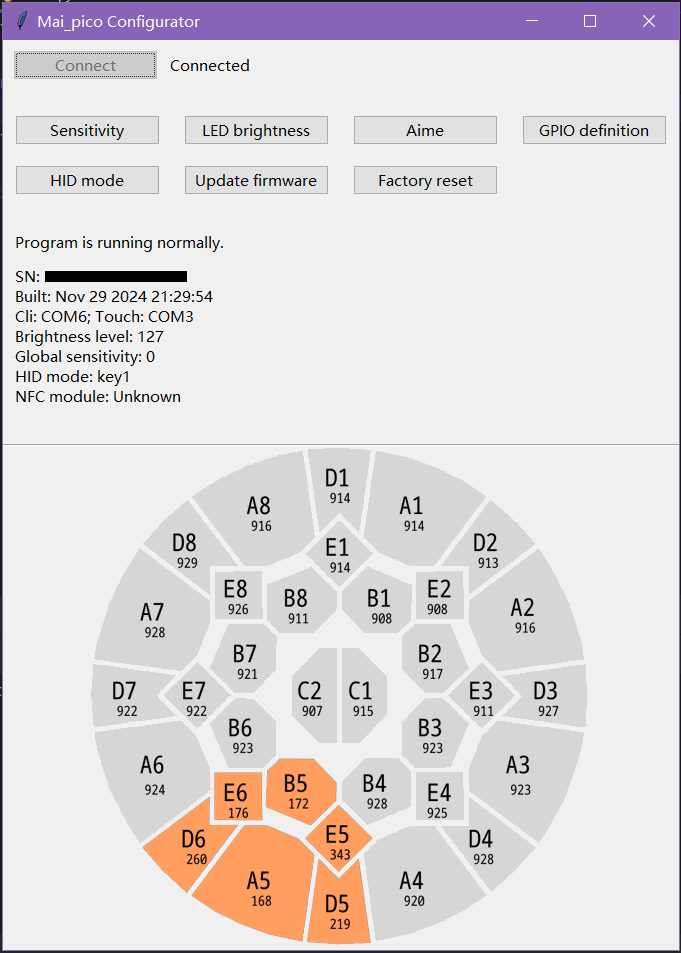

# mai_pico_configurator

This is a visualize configurator for [mai_pico](https://github.com/whowechina/mai_pico), writing in Python Tkinter framework.

## Screenshots

## To-do

- Support for non Windows platforms.

- Add more functions.

Any suggestions for new features, bug report ~~or pull requests~~ are welcome.

The project is still under development, the stable version will be released soon. Stay tuned!

## Introduction

The project provides a simple configuration GUI for the project [mai_pico](https://github.com/whowechina/mai_pico).

Mainly relies on communicating with the CLI serial port, and parsing the response text from CLI serial port.

Run command `py main.py` **in this project directory** to start this program, and click `Connect` button to connect to your device and use.

| Running environment |                                                 |
|---------------------|-------------------------------------------------|
| CPU                 | Intel Core i7-1165G7                            |
| Memory              | 16GB                                            |
| Screen resolution   | 1920x1080                                       |
| Operating system    | Windows 10                                      |
| Python version      | 3.12                                            |
| The using packages  | Why don't run `pip install -r requirements.txt` |

## Features

- It is possible to run on non Windows platforms.

- Show in a larger interface if you are using dual screens and/or your screen is displaying in portrait. You can disable this feature in `config.yaml`.

- Automatically get the COM port information and modify the config if you don't config it properly. It works on Windows and implements with Powershell. This can also be disabled in `config.yaml`.

- Real-time displaying of its sensor raw readings, sensitivity adjustment, and sensor touching.

### Sensitivity adjust

Click the "Sensitivity" button, type the area you want to adjust using your keyboard, and adjust it using arrow `←` or `→`. Then apply the changes with Enter.

You can turn back to the main screen by pressing `Esc`. This is also available to use in the following functions.

### LED brightness

Click the "LED brightness" button, and a window will pop up. Slide the slider to adjust the brightness level.

Click "Apply" to make the changes take effect. The "OK" button will apply and close the window.

### Buttons adjust (GPIO definition)

Click the "GPIO definition" button, and three option will appear.

The **Main button** option can remap the sequence on your button ring if the <b>BT* pad</b> sequence that you solder the wire is not the same as the official one. <b>This function is only available in key* HID mode.</b>

And, this **only** works if you solder a wire on BT* pad or the upstream pad. Or, you will need to type your definition by pressing `Insert`.

The **Aux button** option can remap the sequence of auxiliary button like Test, Service, Navigate, and Coin. In this option, you can only type the GP number, for most people may don't use them.

Moreover, there's no extended pads for Test and Coin on the official IO board v1.0. For the two aux buttons, you will need to solder the wire directly from the pads from Pico, and find a pad for ground. Due to this reason, the function was designed like this.

### Aime

Click the "Aime" button, use arrow `↑` and `↓` to navigate option, and use arrow `←` or `→` to adjust the target value.

Apply the settings by pressing Enter.

### HID mode

Click the "HID mode" button, and change the mode using arrow `↑` and `↓`.

You must know the difference of these mode.

Press Enter to apply.

### Update

Just simply click the "Update firmware". The program will exit and the disk for placing the firmware will appear.

## Special thanks

- [Python](https://python.org)

- [mai_pico](https://github.com/whowechina/mai_pico) by Whowechina.

- [cvsjason](https://github.com/cvsjason) for touch port communication implementation.

## License

This project is licensed under a GPL v3 license.